# Hi, I'm SoCuul!

I'm a Canadian developer, who's currently a student. I spend most of my time tinkering with Darwin-based OSes, and the software that runs on them.

Enjoys working with Swift, Objective-C, TypeScript, and a little bit of everything else.

## Links
```diff
+ Site: socuul.dev
+ Twitter: @SoVeryCuul
+ Reddit: u/emojimasteryt
+ Twitch: verycuul
+ Discord (personal, not for support): @socuul
+ Email: support@socuul.dev
```

## Stack

### Languages
[]()

### Frameworks
- AppKit
- UIKit
- SwiftUI
- Vue.js/Nuxt

### Operating Systems
[]()

## Stats


## Donate
If you'd like to support my work, feel free to [buy me a coffee](https://ko-fi.com/socuul)!
